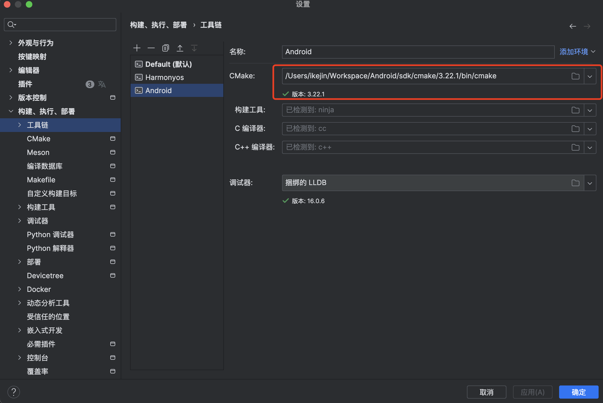
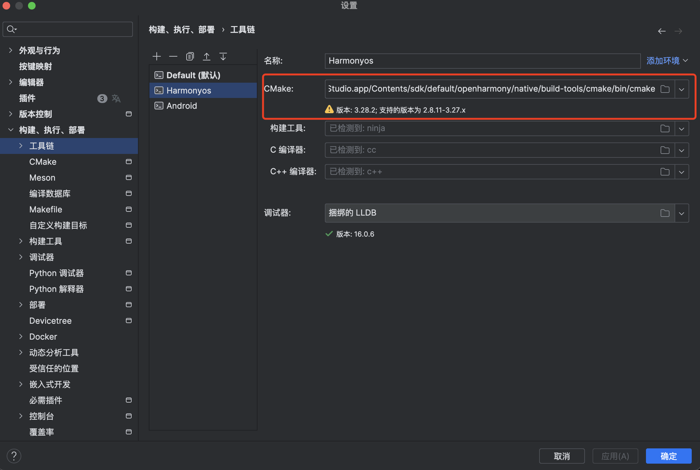
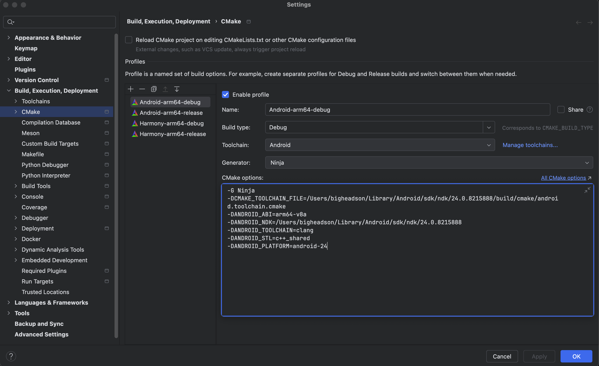
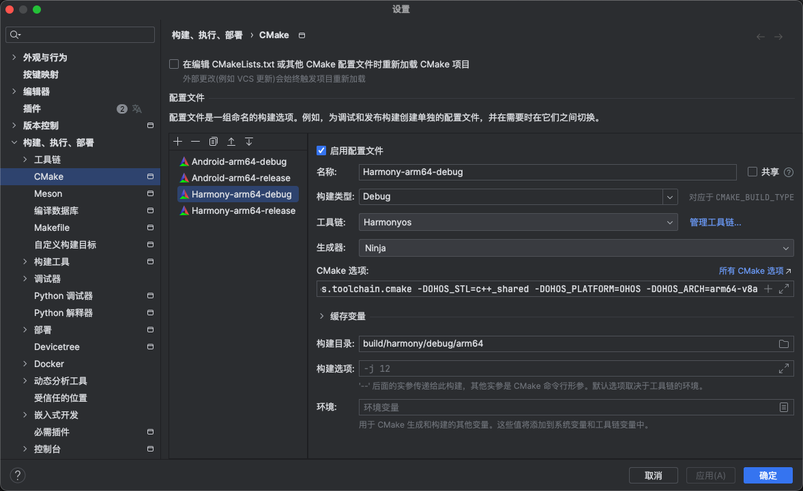

# HarmonyAndroidNative

## 简介

HarmonyAndroidNative 是一个对 HarmonyOS 和 Android Native API 的封装，
同时将两个平台的代码整合在一个项目中，尽可能实现在开发中只维护一套 native 代码。


## 使用

### 项目配置

本项目使用 CLion 作为开发工具, CMake 作为构建工具.
首先先配置 CMake 工具链，分别配置 HarmonyOS 和 Android 的 CMake 工具链。




再配置 CMake 的 profile，分别配置 HarmonyOS 和 Android 的 profile。



CMake 选项：
```text
-G Ninja
-DCMAKE_TOOLCHAIN_FILE=/Users/ikejin/Library/Android/sdk/ndk/24.0.8215888/build/cmake/android.toolchain.cmake
-DANDROID_ABI=arm64-v8a
-DANDROID_NDK=/Users/ikejin/Library/Android/sdk/ndk/24.0.8215888
-DANDROID_TOOLCHAIN=clang
-DANDROID_STL=c++_shared
-DANDROID_PLATFORM=android-24
```



CMake 选项：
```text
-G Ninja
-DCMAKE_TOOLCHAIN_FILE=/Applications/DevEco-Studio.app/Contents/sdk/default/openharmony/native/build/cmake/ohos.toolchain.cmake
-DOHOS_STL=c++_shared
-DOHOS_PLATFORM=OHOS
-DOHOS_ARCH=arm64-v8a
```

### 项目结构

```
build/                   # 构建目录
   |_ android/           # Android 构建目录
        |_ debug/        # Android Debug 构建目录
            |_ arm64-v8a/ 
        |_ release/      # Android Release 构建目录
            |_ arm64-v8a/ 
   |_ harmony/           # HarmonyOS 构建目录
        |_ debug/        # HarmonyOS Debug 构建目录
            |_ arm64-v8a/ 
        |_ release/      # HarmonyOS Release 构建目录
            |_ arm64-v8a/ 
   |_ local/             # 本地构建目录
        |_ debug/        # 本地 Debug 构建目录
        |_ release/      # 本地 Release 构建目录
   |_ install/           # 安装目录
   
libs/                    # 依赖库目录
    |_ android/          # Android 依赖库目录
    |_ harmony/          # HarmonyOS 依赖库目录
    |_ local/            # 本地依赖库目录
    |_ common/           # 共享依赖库目录
    
src/                     # 源码目录
    |_ android/          # Android 源码目录
    |_ harmony/          # HarmonyOS 源码目录
    |_ local/            # 本地源码目录
    |_ common/           # 共享源码目录

samples/                 # 示例代码目录
    |_ android/          # Android 示例代码目录
    |_ harmony/          # HarmonyOS 示例代码目录
    |_ local/            # 本地示例代码目录
CMakeLists.txt           # 项目 CMakeLists.txt
```

### 通用代码

**common/Log.h**

```cpp
_INFO("info message");
_DEBUG("debug message");
_WARN("warn message");
_ERROR("error message");
_FATAL("fatal message"); // 抛出运行时异常

// 如果没有定义 LOG_TAG，默认使用 zzz_native
#ifndef LOG_TAG
#define LOG_TAG "zzz_native"
#endif

// 如果不是 debug 模式，默认关闭 debug 和 info 日志
#ifdef __DEBUG__
#define __LOG_DEBUG(msg) OH_LOG_DEBUG(LOG_APP, "%{public}s", msg);
#define __LOG_INFO(msg) OH_LOG_INFO(LOG_APP, "%{public}s", msg);
#else
#define __LOG_DEBUG(msg)
#define __LOG_INFO(msg)
#endif

// debug 模式默认为严格模式，即使用 _ERROR() 直接抛出运行时异常
#ifdef __DEBUG__
#define STRICT_MODE true
#else
#define STRICT_MODE false
#endif

// 设置日志文件路径
void setLogFile(const char *path)
```

**common/utils/EventThread.h**

类似 Android 的 HandlerThread，用于在一个单独的线程中处理事件

```cpp
EventThread *thread = new EventThread("event-thread");
thread->post([]() {
    // do something
});
thread->sync([]() {
    // do something
}, 1000);
thread->quit(); // 在 delete 之前必须调用 quit
delete thread;
```

**common/utils/FileUtils.h**

```cpp
Directory dir("/sdcard");
dir.listFiles();
dir.listFilesAlphaSort();

FileUtils::read("/sdcard/test.txt").toString();
```

**common/utils/TimeUtils.h**

```cpp
TimeUtils::nowMs();
TimeUtils::nowUs();
TimeUtils::sleepMs(1000);
```

**common/utils/YuvUtils.h**

```cpp
YuvUtils::rgbaToNV21(rgba, width, height, nv21);

static Array m_temp_data;
uint8_t *tmpData = m_temp_data.obtain<uint8_t>(m_detect_width * m_detect_height + rw * rh/2 + 100);
YuvUtils::scaleNV21(m_frame.data(), rawWidth(), rawHeight(), dstData, m_detect_width, m_detect_height, tmpData);
```
**gles**

简单的纹理渲染

```cpp
TextureFilter m_texture_filter;

finalFb.create(outWidth, outHeight);
m_texture_filter.simpleRender(id, outWidth, outHeight, &finalFb);

m_texture_filter.viewport().set(viewWidth, viewHeight).enableClearColor(0, 0, 0, 1);
GLRect rect = GLRect::centerCrop(outWidth, outHeight, viewWidth, viewHeight);
m_texture_filter.setVertexCoord(rect, viewWidth, viewHeight).setTextureCoord(0, false, true);
m_texture_filter.inputTexture(finalFb.texID());
m_texture_filter.render();
```

自定义 2D filter
```cpp 
class TextureFilter : public BaseFilter {
public:
    TextureFilter() : BaseFilter("texture_filter") {
        defAttribute("position", DataType::FLOAT_POINTER)->bind(vertexCoord());
        defAttribute("inputTextureCoordinate", DataType::FLOAT_POINTER)->bind(textureCoord());
        defUniform("inputImageTexture", DataType::SAMPLER_2D);
        defUniform("alpha", DataType::FLOAT)->set(1.0f);
    }

    const char *vertexShader() override {
#ifndef GLAPI
        return R"(
        attribute vec4 position;
        attribute vec2 inputTextureCoordinate;
        varying highp vec2 textureCoordinate;
        void main() {
            gl_Position = position;
            textureCoordinate = inputTextureCoordinate;
        })";
#else
        return R"(
        #version 330 core
        in vec4 position;
        in vec2 inputTextureCoordinate;
        out highp vec2 textureCoordinate;
        void main() {
            textureCoordinate = inputTextureCoordinate;
            gl_Position = position;
        })";
#endif
    }

    const char *fragmentShader() override {
#ifndef GLAPI
        return R"(
        varying highp vec2 textureCoordinate;
        uniform sampler2D inputImageTexture;
        uniform mediump float alpha;
        void main() {
            highp vec4 c = texture2D(inputImageTexture, textureCoordinate);
            gl_FragColor = vec4(c.rgb, c.a*alpha);
        })";
#else
        return R"(
        #version 330 core
        in highp vec2 textureCoordinate;
        uniform sampler2D inputImageTexture;
        uniform mediump float alpha;
        out vec4 fragColor;
        void main() {
            vec4 c = texture(inputImageTexture, textureCoordinate);
            fragColor = vec4(c.rgb, c.a*alpha);
        })";
#endif
    }

    TextureFilter &inputTexture(int id) {
        uniform("inputImageTexture")->set(id);
        return *this;
    }

    TextureFilter &inputTexture(const Texture &texture) {
        uniform("inputImageTexture")->set((int)texture.id());
        return *this;
    }

    TextureFilter &blend(bool enable) {
        m_blend = enable;
        return *this;
    }

    TextureFilter &alpha(float a) {
        uniform("alpha")->set(a);
        return *this;
    }
    
    void onRender(Framebuffer *output) override {
        if (m_blend) {
            glEnable(GL_BLEND);
            glBlendFunc(GL_SRC_ALPHA, GL_ONE_MINUS_SRC_ALPHA);
        } else {
            glDisable(GL_BLEND);
        }
        BaseFilter::onRender(output);
    }

    void onPostRender(Framebuffer *output) override {
        BaseFilter::onPostRender(output);
        if (m_blend) {
            glDisable(GL_BLEND);
        }
    }

private:
    bool m_blend = false;
};
```

### 移动端（ANDROID & HarmonyOS）代码

**AppContext.h**

```cpp
// 初始化 AppContext
AppContext::initialize(xxx);

// 初始化之后就可以获取 AssetsMgr
AppContext::getAssetsMgr()
```

**common/utils/AssetsMgr.h**

```cpp
bool isFile(const char *path);

bool isDirectory(const char *path);

/**
 * 打开目录
 * @param path
 * @return 没有文件夹打开失败返回 nullptr
 */
std::shared_ptr<AssetDir> openDir(const char *path) = 0;

std::shared_ptr<AssetFile> openFile(const char *path) {
    return openFile(path, AssetsReadMode::STREAMING);
}

/**
 * 打开文件
 * @param path
 * @return 没有文件打开失败返回 nullptr
 */
std::shared_ptr<AssetFile> openFile(const char *path, AssetsReadMode mode);

std::shared_ptr<AssetFile64> openFile64(const char *path);

/**
 * 打开大文件
 * @param path
 * @return 没有文件打开失败返回 nullptr
 */
std::shared_ptr<AssetFile64> openFile64(const char *path, AssetsReadMode mode);
```

**common/gles/GLEngine.h**

```cpp
GLEngine engine("main", 3);
engine.updateSurface(window, width, height);

// 在 Android 上对应的是 NativeWindow, 需要自己管理 surface 的生命周期
NativeWindow window = NativeWindow::fromSurface(env, jsurface);
window.bindToGLEngine(engine);

// 在 鸿蒙 上对应 XComponent，鸿蒙上有 XComponentGLBinder, 不需要管理 surface 的生命周期
XComponentGLBinder binder(&engine);
binder.bind("xcomponent_id");

engine.postRender([](int width, int height) {
    if (width == 0 || height == 0) {
        return false; // 返回 false 表示不执行 swapbuffer
    }
    GLUtils::clearColor(0.0f, 0.0f, 0.0f, 1.0f);
    return true; // 返回 true 表示执行 swapbuffer
});

engine.destroy();
```

### 运行 local sample

本地运行的相关代码在 `samples/local` 目录下，可以直接运行。

```cpp
class GLRenderer {
public:
    static int run(int width=1280, int height=720, const char *title="ZNativeSample");

private:
    // 在 Imgui::render() 之前
    static void onRender(int width, int height);

    // 画 imgui
    static void onRenderImgui(int width, int height, ImGuiIO& io);

    // 在 Imgui::render() 之后
    static void onPostRender(int width, int height);

    // 窗口关闭
    static void onExit();
};
```

## TODO LIST

* [ ] 实现 Android 的 Camera 封装
* [ ] 实现 Android 的 MediaCodec 封装
* [ ] 实现 Android 的 AudioRecord 封装
* [ ] 实现 Android 的 Sensor 封装
* [ ] 实现双端的 Sample App